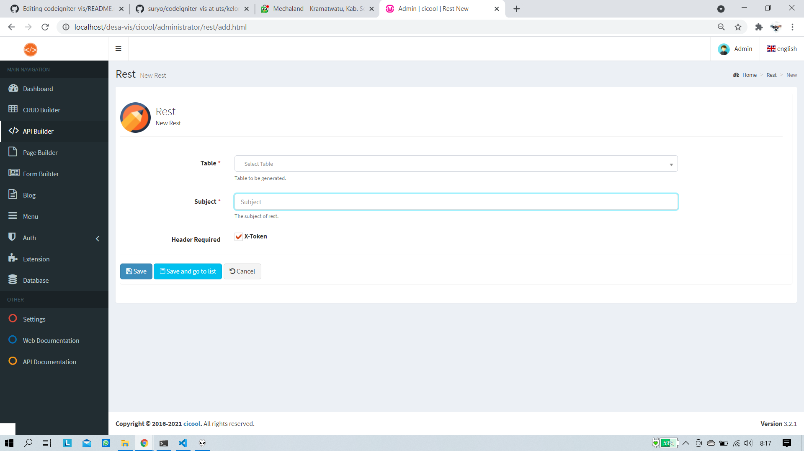
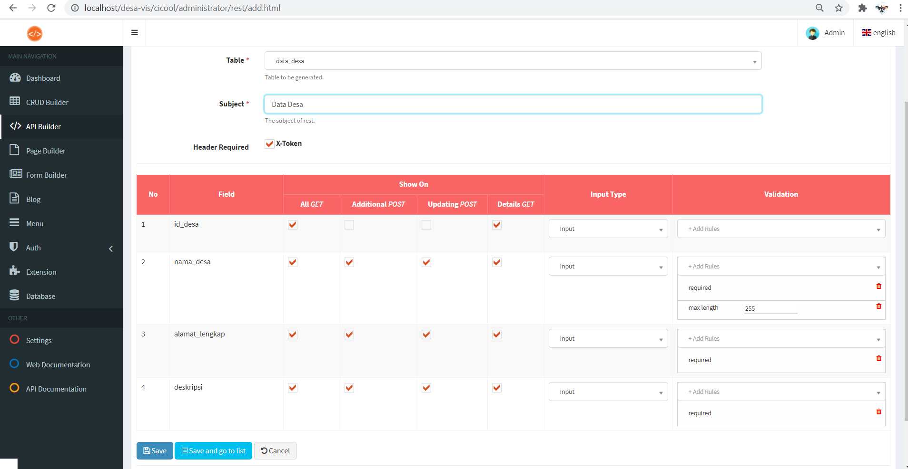

# API with cicool

## uts/kelompok4
---

### API User Login

- Username  : admin@gmail.com

- Password  : admin123 

---

### ADD API ON CICOOL

1. Choose Api Builder menu on Main Navigation
2. After that choose menu Add New Rest
- 
3. Choose what database you need build a api rest (*you must import or create before this*)
- 
4. Crosscheck option on api rest
5. Click Save

Done API REST succesfull created

---
### Preview API

### Preview Database

